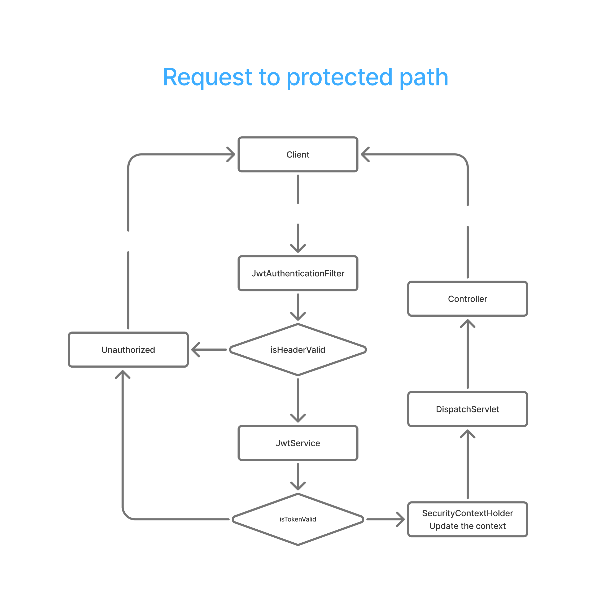
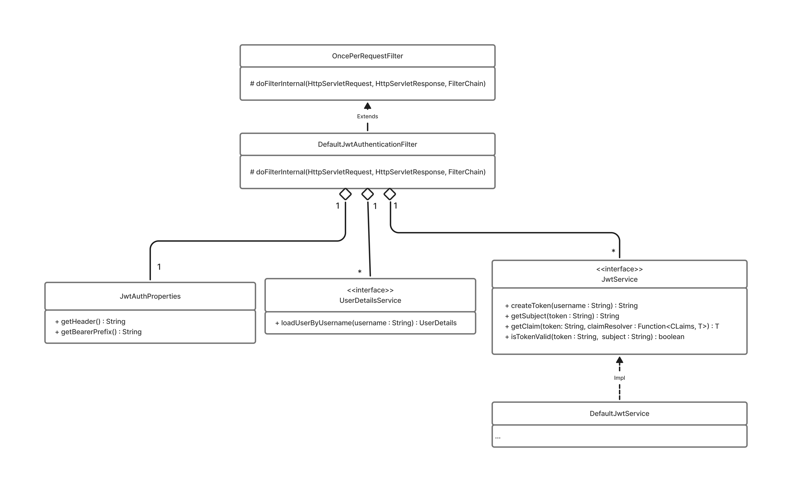

## Json Web Token (JWT) Authentication 

Implementation of JWT using spring boot security v6 and spring framework boot v4 as a shared library

**Components:**
- jwt-auth-starter: no impl but a default set of dependencies
- jwt-auth-autoconfigure: Implementation with the help of spring boot 
- jwt-auth-core: Implementations that are not dependent on any specific framework  
- jwt-auth-test: Test framework and also Integration + System tests

### Authentication flow:

1. Accessing protected path: 
To access protected resources, user should provide a valid token, the request will go the following flow:

### Class diagram

